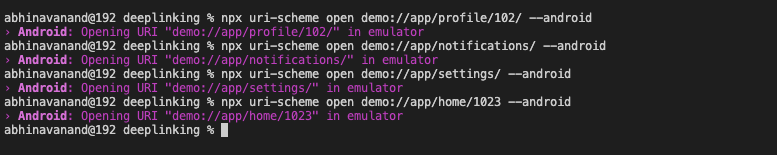

# DeepLinking
## This app is based on React Native and uses DeepLinking.

### Screenshots:

### ``` Home Screen ```
<div align="center">
  
  </div>
  
### ``` Profile Screen ```
<div align="center">
  
  </div>
  
### ``` Notification Screen ```
<div align="center">
  
  </div>
  
### ``` Settings Screen ```
<div align="center">
  
  </div>
  
### ``` Linking Buttons Screen ```
<div align="center">
  
  </div>
  
### ``` Profile Screen - DeepLink id: 102, 1023 ```
<div align="center">
  
  
  </div>
  
### ``` Terminal Screen ```
<div align="center">
  
  </div>
  
### ``` Installation Process ```

### 1. ``` Download or clone the Repository. ```
### 2. ``` npm install / yarn add install ```
### 3. ``` npx react-native start ```
### 4. ``` npx react-native run-android ```
### 5. ``` npx uri-scheme open demo://app/profile/102 --android ```
